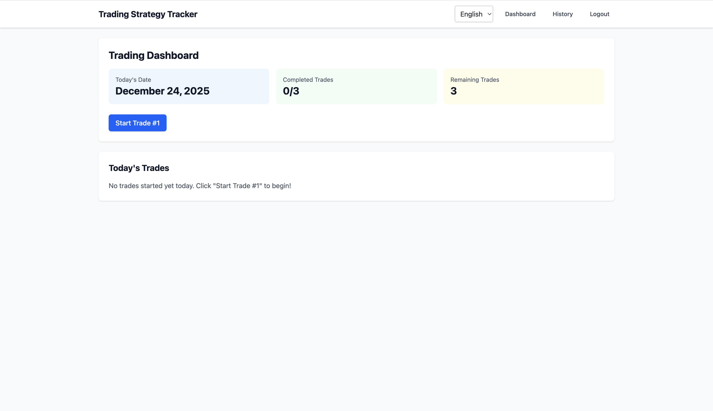
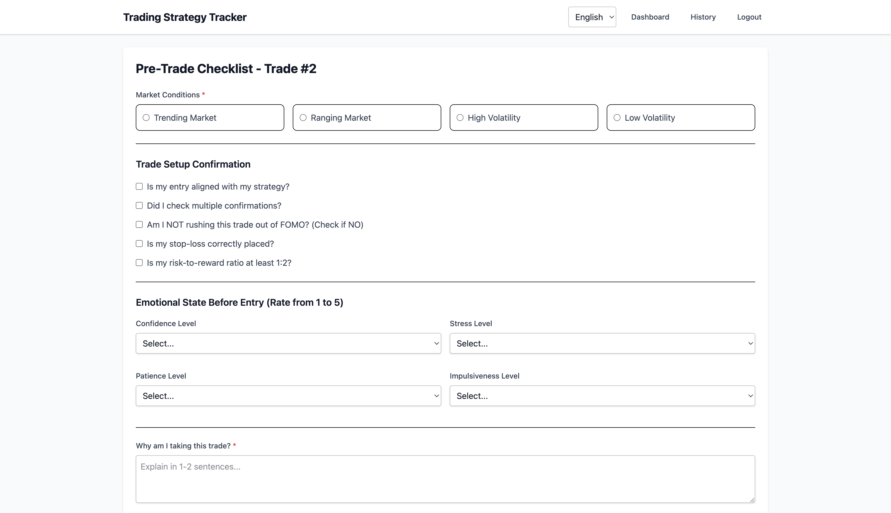
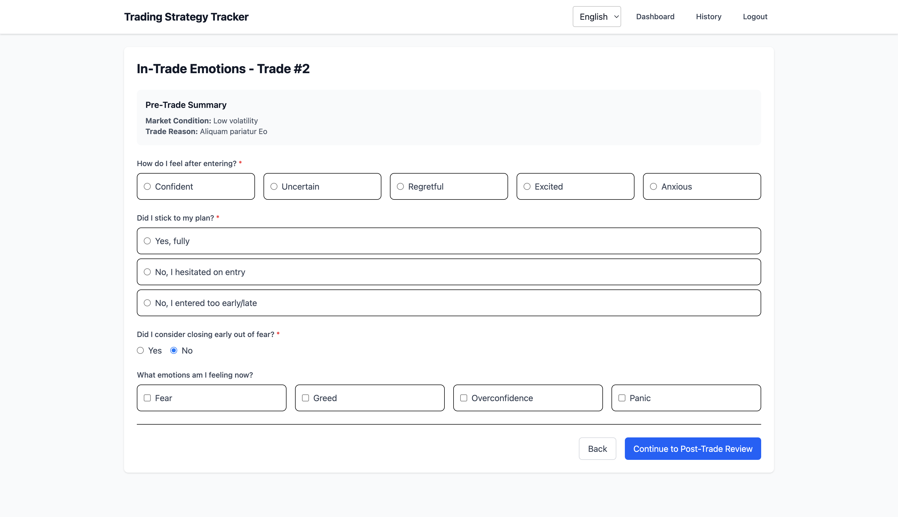
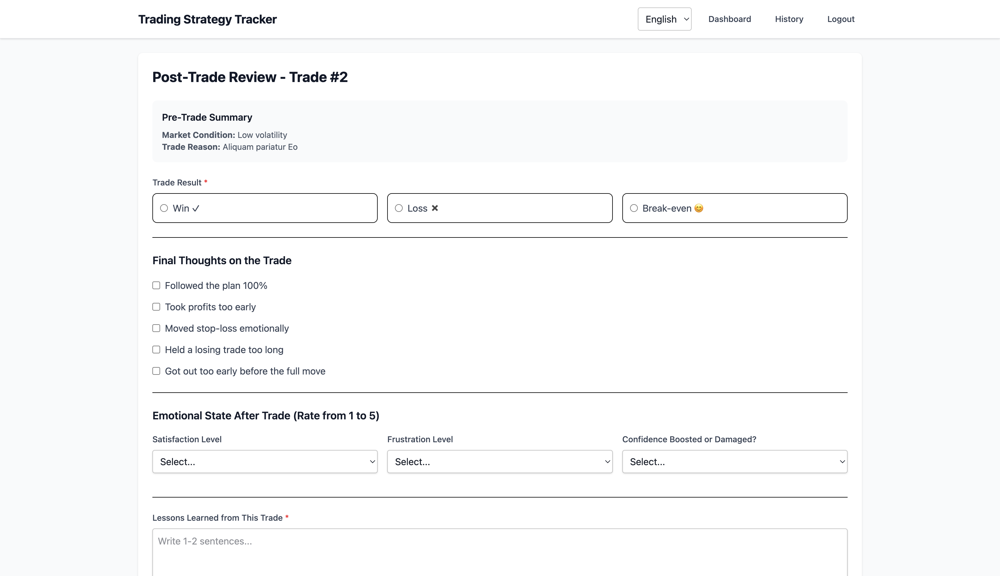
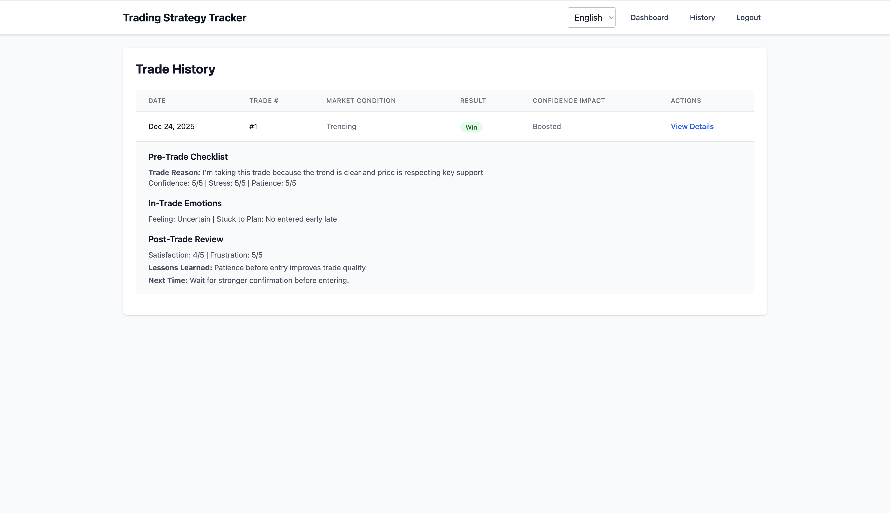
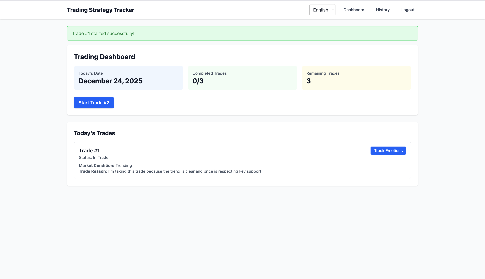

# Trading Strategy Tracker

A comprehensive web application for tracking trading psychology and strategy adherence. Built with Laravel 12, this application helps traders maintain discipline by tracking pre-trade checklists, in-trade emotions, and post-trade reviews with a daily limit of 3 trades per day.

## 📸 Screenshots

<div align="center">

### Dashboard

*Main trading dashboard showing today's trades and statistics*

### Pre-Trade Checklist

*Comprehensive pre-trade checklist form*

### In-Trade Emotions

*Tracking emotions and behavior during active trades*

### Post-Trade Review

*Complete post-trade analysis and review*

### Trade History

*View and analyze all completed trades*

### Multi-Language Support

*Switch between English and Hindi*

</div>

> **Note**: To add your screenshots, save them in the `docs/images/` directory with the filenames shown above. See [docs/SCREENSHOTS.md](docs/SCREENSHOTS.md) for detailed instructions.

## 📋 Table of Contents

- [Features](#features)
- [Technology Stack](#technology-stack)
- [Requirements](#requirements)
- [Installation](#installation)
- [Configuration](#configuration)
- [Usage](#usage)
- [Multi-Language Support](#multi-language-support)
- [Database Structure](#database-structure)
- [Project Structure](#project-structure)
- [Contributing](#contributing)
- [License](#license)

## ✨ Features

### Core Features

- **Daily Trade Limit**: Enforces a maximum of 3 trades per day (resets daily)
- **Pre-Trade Checklist**: Comprehensive checklist before entering a trade
  - Market condition analysis (Trending, Ranging, High/Low Volatility)
  - Trade setup confirmation (5 key questions)
  - Emotional state assessment (Confidence, Stress, Patience, Impulsiveness)
  - Trade reasoning documentation

- **In-Trade Tracking**: Monitor emotions and behavior during active trades
  - Feeling assessment after entry
  - Plan adherence tracking
  - Early closing considerations
  - Current emotional state (Fear, Greed, Overconfidence, Panic)

- **Post-Trade Review**: Complete analysis after trade completion
  - Trade result (Win/Loss/Break-even)
  - Final thoughts and self-assessment
  - Emotional state after trade
  - Lessons learned and improvement plans

- **Trade History**: View and analyze all completed trades with detailed information

### Additional Features

- **Multi-Language Support**: Available in English and Hindi (easily extensible)
- **User Authentication**: Secure login and registration system
- **Responsive Design**: Modern UI with Tailwind CSS, works on all devices
- **Dark Mode Support**: Built-in dark mode compatibility

## 🛠 Technology Stack

- **Backend**: Laravel 12 (PHP 8.2+)
- **Frontend**: Blade Templates, Tailwind CSS 4.0
- **Database**: MySQL/PostgreSQL/SQLite (configurable)
- **Build Tool**: Vite 7
- **Authentication**: Laravel Breeze (Blade stack)

## 📦 Requirements

- PHP >= 8.2
- Composer
- Node.js >= 18.x and npm
- MySQL 5.7+ / PostgreSQL 10+ / SQLite 3
- Web server (Apache/Nginx) or PHP built-in server

## 🚀 Installation

### Step 1: Clone the Repository

```bash
git clone <repository-url>
cd trading-emotions-tracker
```

### Step 2: Install PHP Dependencies

```bash
composer install
```

### Step 3: Install Node Dependencies

```bash
npm install
```

### Step 4: Environment Configuration

Copy the `.env.example` file to `.env`:

```bash
cp .env.example .env
```

Generate application key:

```bash
php artisan key:generate
```

Update `.env` file with your database credentials:

```env
DB_CONNECTION=mysql
DB_HOST=127.0.0.1
DB_PORT=3306
DB_DATABASE=your_database_name
DB_USERNAME=your_username
DB_PASSWORD=your_password
```

### Step 5: Run Migrations

```bash
php artisan migrate
```

### Step 6: Build Frontend Assets

For production:

```bash
npm run build
```

For development (with hot reload):

```bash
npm run dev
```

### Step 7: Start the Development Server

```bash
php artisan serve
```

The application will be available at `http://localhost:8000`

## ⚙️ Configuration

### Application Settings

Key configuration files:

- `.env` - Environment variables (database, app settings)
- `config/app.php` - Application configuration
- `config/auth.php` - Authentication settings

### Daily Trade Limit

The daily trade limit is set to 3 trades per day by default. To change this, modify the constant in:

```php
// app/Http/Controllers/TradeController.php
const MAX_TRADES_PER_DAY = 3;
```

## 📖 Usage

### Getting Started

1. **Register an Account**
   - Navigate to `/register`
   - Fill in your name, email, and password
   - Click "Register"

2. **Login**
   - Go to `/login`
   - Enter your credentials
   - Access your trading dashboard

3. **Start Your First Trade**
   - Click "Start Trade #1" on the dashboard
   - Complete the pre-trade checklist
   - Submit to begin tracking

4. **Track In-Trade Emotions**
   - After starting a trade, click "Track Emotions"
   - Fill out your current emotional state
   - Continue to post-trade review

5. **Complete Trade Review**
   - Fill out the post-trade review form
   - Record lessons learned
   - Submit to complete the trade

6. **View History**
   - Navigate to "History" in the menu
   - Review all your completed trades
   - Click "View Details" for more information

### Workflow

```
Dashboard → Start Trade → Pre-Trade Checklist → In-Trade Emotions → Post-Trade Review → Completed
```

## 🌍 Multi-Language Support

The application supports multiple languages. Currently available:

- **English** (en) - Default
- **Hindi** (hi) - हिंदी

### Switching Languages

Use the language dropdown in the navigation bar to switch between available languages. Your preference is saved in the session.

### Adding New Languages

1. Create a new language file in `lang/{locale}/messages.php`
2. Copy the structure from `lang/en/messages.php`
3. Translate all values
4. Add the option to the language switcher in `resources/views/trades/layout.blade.php`

Example:

```php
// lang/es/messages.php
return [
    'dashboard' => 'Panel de Control',
    'history' => 'Historial',
    // ... more translations
];
```

## 🗄 Database Structure

### Tables

#### `trades`
- Main trade records
- Tracks: user_id, trade_date, trade_number, status
- Unique constraint: user_id + trade_date + trade_number

#### `trade_checklists`
- Pre-trade checklist data
- Market conditions, setup confirmations, emotional state

#### `trade_emotions`
- In-trade emotional tracking
- Feelings, plan adherence, current emotions

#### `trade_reviews`
- Post-trade review data
- Results, lessons learned, improvement plans

### Relationships

```
User → hasMany → Trades
Trade → hasOne → TradeChecklist
Trade → hasOne → TradeEmotion
Trade → hasOne → TradeReview
```

## 📁 Project Structure

```
trading-emotions-tracker/
├── app/
│   ├── Http/
│   │   ├── Controllers/
│   │   │   ├── Auth/
│   │   │   │   ├── LoginController.php
│   │   │   │   └── RegisterController.php
│   │   │   ├── LanguageController.php
│   │   │   └── TradeController.php
│   │   └── Middleware/
│   │       └── SetLocale.php
│   └── Models/
│       ├── Trade.php
│       ├── TradeChecklist.php
│       ├── TradeEmotion.php
│       └── TradeReview.php
├── database/
│   └── migrations/
│       ├── create_trades_table.php
│       ├── create_trade_checklists_table.php
│       ├── create_trade_emotions_table.php
│       └── create_trade_reviews_table.php
├── lang/
│   ├── en/
│   │   └── messages.php
│   └── hi/
│       └── messages.php
├── resources/
│   └── views/
│       ├── auth/
│       │   ├── login.blade.php
│       │   └── register.blade.php
│       └── trades/
│           ├── layout.blade.php
│           ├── index.blade.php
│           ├── create.blade.php
│           ├── show.blade.php
│           ├── review.blade.php
│           └── history.blade.php
└── routes/
    └── web.php
```

## 🧪 Development

### Running Tests

```bash
php artisan test
```

### Code Style

The project uses Laravel Pint for code formatting:

```bash
./vendor/bin/pint
```

### Building Assets

Development mode (with hot reload):

```bash
npm run dev
```

Production build:

```bash
npm run build
```

## 🔒 Security

- Password hashing using bcrypt
- CSRF protection on all forms
- SQL injection protection via Eloquent ORM
- XSS protection via Blade templating
- Authentication middleware on protected routes

## 🐛 Troubleshooting

### Common Issues

**Issue**: Vite manifest not found
```bash
npm run build
```

**Issue**: Route not found
```bash
php artisan route:clear
php artisan config:clear
```

**Issue**: Migration errors
```bash
php artisan migrate:fresh
```

**Issue**: Language not switching
- Clear browser cache
- Check session configuration in `.env`

## 📝 Notes

- The daily trade limit resets at midnight (server time)
- Trade numbers are sequential per day (1, 2, 3)
- All trade data is user-specific and private
- Language preference is stored in session (not persistent across devices)

## 🤝 Contributing

Contributions are welcome! Please feel free to submit a Pull Request.

1. Fork the repository
2. Create your feature branch (`git checkout -b feature/AmazingFeature`)
3. Commit your changes (`git commit -m 'Add some AmazingFeature'`)
4. Push to the branch (`git push origin feature/AmazingFeature`)
5. Open a Pull Request

## 📄 License

This project is open-sourced software licensed under the [MIT license](https://opensource.org/licenses/MIT).

## 🙏 Acknowledgments

- Built with [Laravel](https://laravel.com)
- UI styled with [Tailwind CSS](https://tailwindcss.com)
- Trading psychology tracker concept based on elite trader practices

## 📧 Support

For support, email anupkumar9344@gmail.com or open an issue in the repository.

---

**Remember**: "The market is not your opponent, it is your mirror. Master Yourself, and you master the trades."

Happy Trading! 📈
